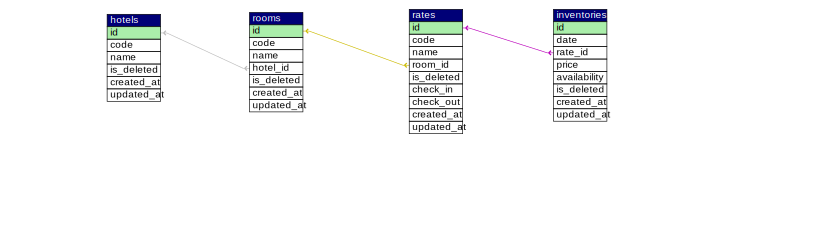

<div align="center">
  <h1>API Hotel Availability</h1>
  <strong>⚡️ This application allows you to make a CRUD related to a Hotel and obtain the availability of the rooms. ⚡️</strong>
</div>

### 📝 Technologies used:

- Express
- Sequelize
- Swagger
- TypeScript
- MySQL

## 🎇 First steps

- Before running the application, you must configure the database.
  In [./sql](./sql/hotel_availability_base.sql), you have available a SQL file with the database structure, you can import this file from a SQL client, remember to create the database first and then import the structure using [this](./sql/hotel_availability_base.sql) file.
- You must define the values of the configuration variables, you can use the [env-example](./env-example) file as for the configuration of the environment variables.
- In the [json](./assets/HotelAvailability.postman_collection.json) file you have the collection available to test the application from postman

### 🚀 Quick Start

- Clone this repo:
  ```bash
  git clone https://github.com/christianddev/api-hotel-availability
  ```

#### 💻 Quick start of development:

- Start up the database & check environment variables.
- From the root of the project, run `yarn` or `yarn install`.
- After installing the dependencies,
  - into another terminal: `yarn dev`.
- Documentation available into [localhost:8000/api/v1/documentation](http://localhost:8000/api/v1/documentation/).

#### 📝 Short Description.

Some of the business rules have been defined at the database level,
for example:
- For example, in some tables the `code` column has been configured as unique (index), with the current structure, it would be more optimal to use the id, since it would allow optimizing some queries, now each record in the code column must be unique.
- A lot of work has been done to implement the temporary deletion of records, the idea is that the records are not permanently deleted, at least not initially.
- The initial development began with the CRUD of Hotels, Rooms, Rates and finally Inventories
- The initial `development started with the CRUD of Hotels, Rooms, Rates and finally Inventories`, it is important to take this into account, since it has affected some developments, for example the documentation of the `hotels` & `rooms` endpoints is the most complete, the endpoint of `availability` should be optimized to take advantage of sequelize.

The relationship:



### 🛠️ Understanding folder structure (Main files)

```bash
📦src
 ┣ 📂common
 ┣ 📂config
 ┣ 📂controllers
 ┃ ┣ 📂utils
 ┣ 📂database
 ┃ ┣ 📂configuration
 ┃ ┣ 📂models
 ┣ 📂docs
 ┃ ┣ 📂common
 ┃ ┣ 📂examples
 ┃ ┣ 📂responses
 ┃ ┣ 📂schemas
 ┣ 📂middleware
 ┃ ┣ 📂utils
 ┃ ┣ 📂validators
 ┃ ┃ ┣ 📂database
 ┃ ┃ ┣ 📂fields
 ┣ 📂routes
 ┃ ┗ 📂v1
 ┣ 📂services
 ┃ ┣ 📂utils
 ┣ 📂types
 ┗ 📜server.ts

```

### Others

##### API response

- [Google JSON Style Guide](https://google.github.io/styleguide/jsoncstyleguide.xml)

### 🛠 Next improvements

- Perform tests to ensure the quality and robustness of the application.
- Improve the typing of data coming from the ORM.
- Apply security over routes using an authentication provider such as OAuth with JWT.
- Apply better logger
- For the test and development environment, use seders or migrations from sequelize to set up a database to improve the experience.
- Configure Docker.

## 👾 known bugs

- api:
  - The database must be ready for operation before starting the application.
- sql:
  - Temporary deletion requires some adjustments, since all CRUD endpoints must be prepared to work in a homogeneous way.
- Swagger documentation does not work correctly in production environment.
